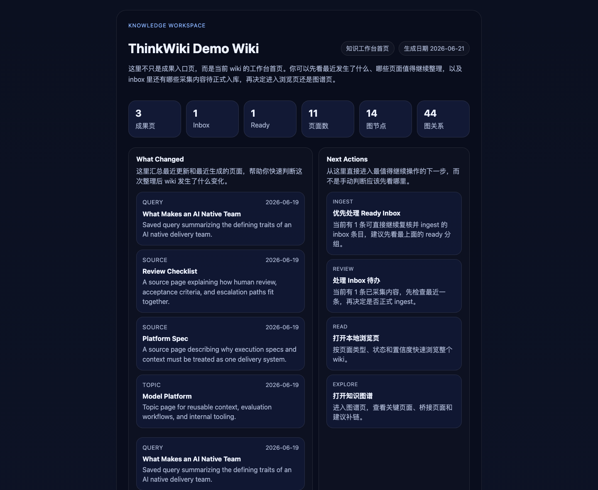
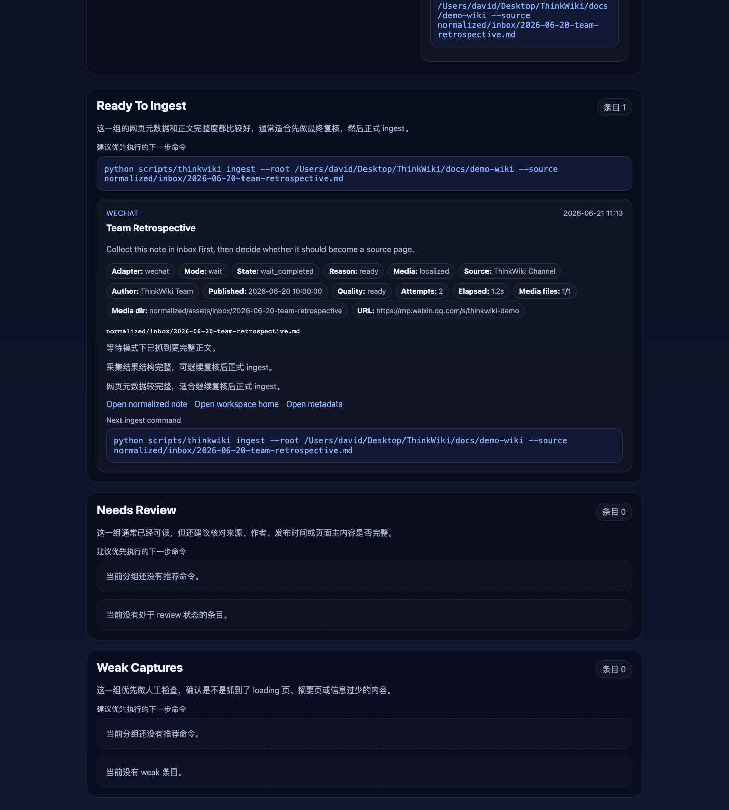
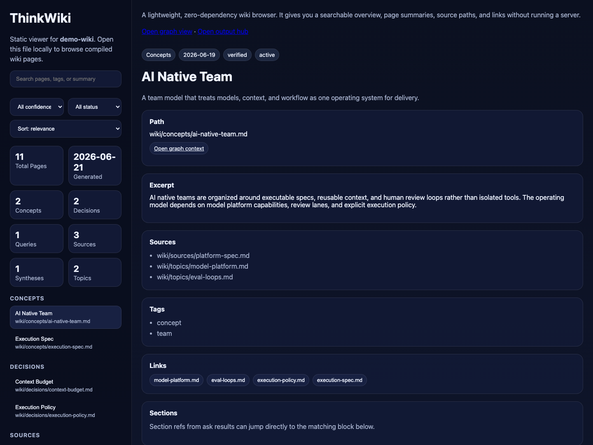
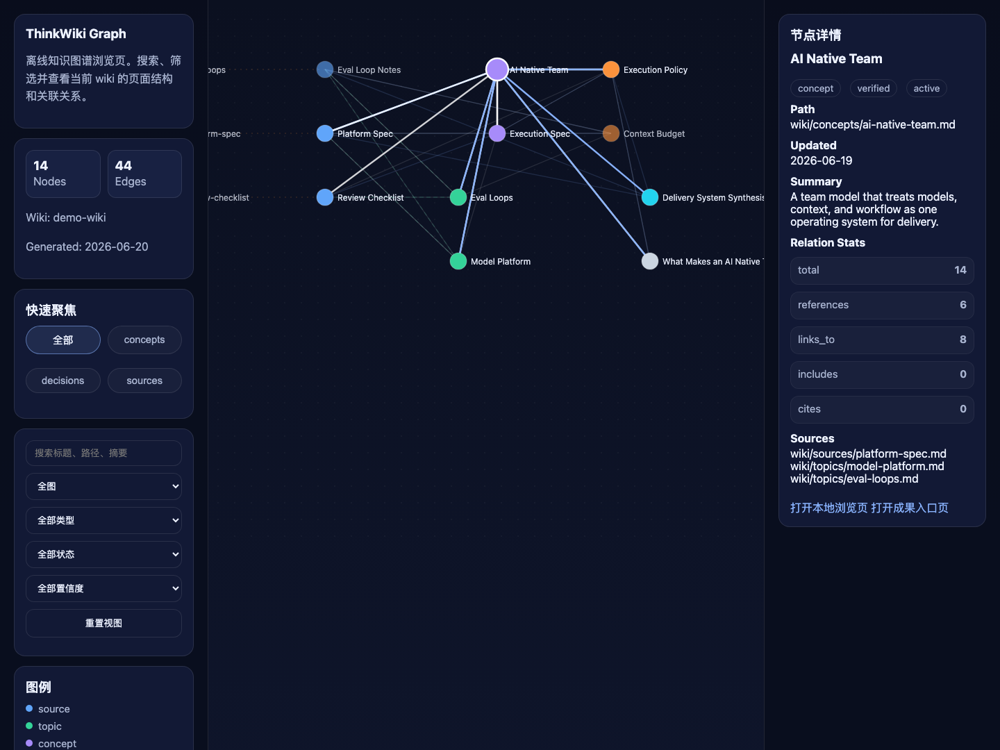

# ThinkWiki

[](https://github.com/wzdavid/ThinkWiki/releases)
[](LICENSE)
[](https://www.python.org/)

ThinkWiki is an **agent-native local knowledge base skill**. Talk to your agent to turn scattered documents, web pages, notes, and conversations into a durable Markdown workspace — with inbox review, local browsing, and an interactive content knowledge graph you can open in a browser.

Chinese version: [README.zh.md](README.zh.md)

Repository: **https://github.com/wzdavid/ThinkWiki**

## Works With Skills-Compatible Agents

ThinkWiki follows the open [Agent Skills](https://agentskills.io) format (`SKILL.md` + bundled scripts). If your agent can install skills and run local commands, it can run ThinkWiki.

You do **not** need to memorize CLI commands. Install the skill once, then create and manage your wiki entirely through conversation.

| Agent / Host | Typical use |
| --- | --- |
| [Claude Code](https://docs.anthropic.com/en/docs/claude-code) | Install the repo as a skill, then ask it to build and query your wiki |
| [OpenClaw](https://openclaw.ai) | Full skill workflow; use `serve` + the built-in browser to open HTML outputs |
| [Trae](https://www.trae.ai) | Install under `.trae/skills`, then manage the wiki in chat |
| [Hermes Agent](https://github.com/NousResearch/hermes-agent) | Local skill directory + shell execution |
| [OpenAI Codex](https://developers.openai.com/codex) / Codex CLI | Skills-compatible coding agents with local file access |
| [Cursor](https://cursor.com) | Agent mode with project skills |
| [Gemini CLI](https://github.com/google-gemini/gemini-cli) | Skills-compatible CLI agent |
| [GitHub Copilot](https://github.com/features/copilot) | Agent / coding workflows in VS Code that support skills |
| Other skills hosts | Any product that loads `SKILL.md` and can run `python3 scripts/thinkwiki ...` locally |

**Requirement:** a local environment with Python 3. ThinkWiki bootstraps its own runtime on first use. Pure cloud chat without local file or shell access cannot run a local wiki.

## Get Started: Install Through Conversation

Point your agent at this repository and ask it to install the skill for you.

**Example prompt:**

> Please install the ThinkWiki skill from https://github.com/wzdavid/ThinkWiki , bootstrap the runtime, and run a health check to confirm everything works on my machine.

The agent will typically clone or copy the skill into your host's skills directory, run `bootstrap`, and verify capabilities with `doctor`. You should not need to run those steps yourself unless you prefer manual setup.

**After installation, start using it immediately:**

> Create a local knowledge base named `My Wiki` in my workspace.

> Clip this article into the inbox first: `https://example.com/article`

> Import this PDF into the wiki: `/path/to/file.pdf`

> Answer from my wiki: what did we already decide about context budgets?

> Build the knowledge graph and open the workspace home in my browser.

The agent reads `SKILL.md`, maps your intent to stable ThinkWiki actions, and reports what changed — including paths to Markdown pages and HTML outputs.

## Why ThinkWiki

- **Agent-first:** users talk to an agent, not to a long list of commands.
- **Local-first:** Markdown files remain the source of truth on your machine.
- **HTML-first:** inbox, viewer, graph, and governance pages are real browsable workspaces.
- **Knowledge-first:** the graph is a content knowledge graph — topics, concepts, entities, claims, and governance — not just a file-link map.

## What It Produces

ThinkWiki generates a workspace that includes:

- `output/index.html`: unified workspace home
- `output/inbox/index.html`: inbox review console
- `output/viewer/index.html`: local page browser
- `output/graph/index.html`: interactive graph explorer
- `output/graph/report.html`: graph governance report
- `output/graph/entity-merge-review.html`: entity merge review page
- `output/graph/entity-merge-plan.html`: entity merge dry-run preview when requested

### Preview

#### Workspace Home (`output/index.html`)

The unified workspace home summarizes recent changes, recommended next actions, inbox backlog, and a graph snapshot so you can decide whether to read, ingest, or explore.



#### Inbox Review (`output/inbox/index.html`)

Review clipped web pages, files, and notes before formal ingest. Items are grouped into `ready`, `review`, and `weak` so you can process the highest-value captures first.



#### Local Viewer (`output/viewer/index.html`)

Browse the entire wiki by page type, confidence, and status. Open any page directly in the viewer without leaving the local HTML workspace.



#### Knowledge Graph (`output/graph/index.html`)

Explore the content knowledge graph interactively. Switch between `knowledge`, `document`, and `suggested` views to inspect semantic relations and candidate edges.



#### Graph Governance Report (`output/graph/report.html`)

Inspect graph health signals such as isolated pages, hub stubs, fragile bridges, suggested links, and entity merge candidates before making structural changes.


## Everyday Commands (In Plain Language)

Once ThinkWiki is installed, these are the kinds of requests users make most often:

| You say | ThinkWiki does |
| --- | --- |
| Create a wiki called `Research Notes` | Initializes a local workspace |
| Clip / save this URL or file to inbox | Captures content for later review |
| Ingest the ready inbox items | Promotes reviewed captures into wiki pages |
| What does my wiki say about X? | Evidence-first Q&A from existing pages |
| Save this answer as a query page | Persists high-value outputs |
| Show me the knowledge graph | Builds/refreshes graph HTML |
| Review entity merge candidates | Surfaces alias collisions for manual confirmation |
| Open the wiki workspace in my browser | Runs `serve` and returns `http://127.0.0.1:8765/index.html` |

## Core Capabilities

- Initialize a local wiki workspace
- Clip web pages, files, or pasted text into an inbox for later review
- Import Markdown, PDF, DOCX, XLSX, XLS, PPTX, web pages, and plain text
- Answer questions from existing wiki pages with evidence-first behavior
- Save high-value outputs as `query`, `synthesis`, `decision`, or `concept` pages
- Build a content knowledge graph with `knowledge`, `document`, and `suggested` views
- Generate entity governance outputs, including ambiguous alias review and deterministic merge flows
- Check runtime health, workspace status, and graph governance state

## Content Knowledge Graph

ThinkWiki `v1.6.0` builds a schema v2 graph with `default_view = knowledge`.

The knowledge view can contain:

- page-backed nodes such as `source`, `topic`, `concept`, `decision`, `synthesis`, `query`, and `entity`
- claim nodes extracted from structured wiki content
- semantic relations such as `about`, `belongs_to`, `depends_on`, `asserts`, `supports`, `contradicts`, and `suggests_related_to`

This means the graph is not limited to raw file references. It can represent knowledge structure, evidence structure, and entity governance directly.

## Browse HTML Outputs

Agent chat UIs usually cannot render ThinkWiki HTML inline. Ask your agent to start the built-in loopback server when you want to inspect inbox, viewer, graph, or governance pages:

> Start the ThinkWiki output server and give me the workspace URL.

Or run it yourself:

```bash
python3 scripts/thinkwiki serve --root /path/to/my-wiki
```

By default this serves `<wiki-root>/output/` at `http://127.0.0.1:8765/`. Start from `http://127.0.0.1:8765/index.html`.

On **OpenClaw**, after `serve` is running, the agent can also open the workspace home with:

```bash
openclaw browser --browser-profile openclaw open http://127.0.0.1:8765/index.html
```

On other agents, open the same URL in your system browser, or use whatever browser tool the host provides.

Use `serve --print-urls` when you only need the URL list without starting the server.

## Environment Variables

Some ThinkWiki features require API keys:

| Variable | Required | Purpose |
|----------|----------|---------|
| `MINIMAX_API_KEY` | No (optional) | MiniMax M2.7 content generation; falls back to heuristics if unset |
| `SILICONFLOW_API_KEY` | No (optional) | SiliconFlow free BGE-M3 embeddings for entity merge dedup; degrades to string-only matching if unset |

`crystallize` and `digest` gracefully fall back to heuristics without `MINIMAX_API_KEY`. Register for a free `SILICONFLOW_API_KEY` at https://siliconflow.cn.

## Manual Install (Optional)

If you prefer to set up the skill yourself instead of asking an agent:

```bash
git clone https://github.com/wzdavid/ThinkWiki ThinkWiki
cd ThinkWiki
python3 scripts/thinkwiki bootstrap
python3 scripts/thinkwiki doctor --repo-root .
```

Then install the folder into your agent's skills directory according to that host's documentation.

## CLI Reference (For Agents And Power Users)

ThinkWiki keeps one stable entry point that agents call under the hood:

```bash
python3 scripts/thinkwiki <command> [args]
```

Common commands: `init`, `clip`, `ingest`, `inbox`, `viewer`, `graph`, `graph-report`, `entity-merge-review`, `entity-merge-apply`, `serve`, `health`, `status`, `doctor`.

See `SKILL.md` for the agent behavior contract and intent mapping.

## Repository Docs

- `README.md`: concise English project overview
- `README.zh.md`: Chinese overview
- `SKILL.md`: skill behavior contract for agent hosts
- `CHANGELOG.md`: release history

## License

MIT
